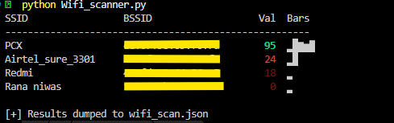
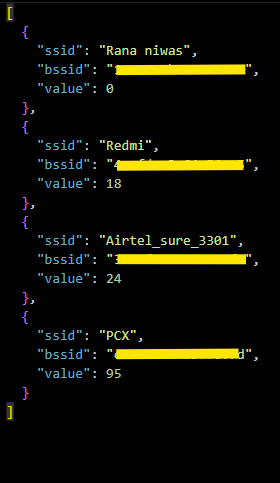

# 🔍 Wi‑Fi Network Scanner (Cross‑Platform)

This Python tool enumerates nearby Wi‑Fi access points on **Windows** or **Linux** and displays their signal strength in both dBm and a five‑bar visual scale.  
Built for pentesters, sysadmins, and anyone who needs reliable network intel without bulky GUI overhead.


## ⚙️ Features

- **Cross‑platform** (Windows 10/11, most Linux distros)  
- Lists **SSID, BSSID, signal strength**, and dynamic **bars**  
- Auto‑detects best backend: `pywifi`, `netsh`, `nmcli`, or `iwlist`  
- Saves raw data to **`wifi_scan.json`** for further processing  
- ANSI‑coloured output (via `colorama`) for quick at‑a‑glance reading  
- No GUI bloat—single terminal command

---

## 🧰 Requirements

```bash
pip install pywifi colorama
```

> `pywifi` provides hardware‑level access when possible.  
> `colorama` ensures coloured output works in Windows terminals.

---

## 🚀 Usage

Run the script:

```bash
python wifi_scan.py
```


---

## 💻 Windows Notes

- Works on Windows 10 & 11.  
- Falls back to `netsh wlan show networks` when `pywifi` doesn’t report.

---

## 🐧 Linux Notes

- Uses `pywifi` if drivers allow. Otherwise:
  1. `nmcli` (fast NetworkManager)
  2. `iwlist` (legacy fallback)

If privileges block scanning:

```bash
sudo python wifi_scan.py
# – or –
sudo setcap cap_net_raw,cap_net_admin=eip $(which python3)
```

---

## 📦 Build a Stand‑Alone EXE (Optional)

```bash
pip install pyinstaller
pyinstaller --onefile --name wifi_scan wifi_scan.py
# Result: dist/wifi_scan.exe
```

---

## 📊 Signal‑to‑Bar Mapping

Dynamic: the script linearly scales the min‑to‑max values found in each run into five equal slices.

Example dBm mapping (static reference only):

| dBm Range  | Bars   | Perception    |
|------------|--------|---------------|
| ≥ ‑50      | ▂█▆▅▇ | Excellent     |
| ‑60…‑51    | ▂█▆▅ | Very Good     |
| ‑70…‑61    | ▂█▆  | Good          |
| ‑80…‑71    | ▂█   | Fair          |
| ≤ ‑81      | ▂    | Weak          |

---

## 🔍 How It Works

| Engine     | Platform | Purpose                               |
|------------|----------|---------------------------------------|
| `pywifi`   | All      | Preferred NIC‑level scan              |
| `netsh`    | Win      | Built‑in CLI fallback                 |
| `nmcli`    | Linux    | NetworkManager‑based fallback         |
| `iwlist`   | Linux    | Legacy raw scan (last resort)         |

---

## 🛠 Troubleshooting

| Symptom              | Remedy                                                                 |
|----------------------|------------------------------------------------------------------------|
| No networks found    | Ensure Wi‑Fi is enabled. Some adapters need admin/sudo to scan.        |
| Permission denied    | Run with `sudo` or grant `cap_net_raw,cap_net_admin` to Python binary. |
| `pywifi` empty list  | Driver/AP combo unsupported—script will fallback automatically.        |

---

## 🧪 Tested Platforms

- Windows 11 (PowerShell + CMD)  
- Kali Linux

---

## 🔐 Permissions

- **Linux**: May require `sudo` or capability grants for raw Wi‑Fi operations.  
- **Windows**: Typically works without elevation.

---

## 📁 Output

- **File**: `wifi_scan.json`  
- **Format**: List of dictionaries with SSID, BSSID, and signal value

---

---

## 📸 Screenshots

### 🔍 Scan Output (with Bars)


### 📁 JSON Output File


---

## 🛡 License

MIT License – free to use, modify, and distribute.  
No warranties. Use at your own risk.

---

## ✒️ Author

Built for warriors who scan fast and act faster.  
**You want the strongest network? This script gets you there.**
